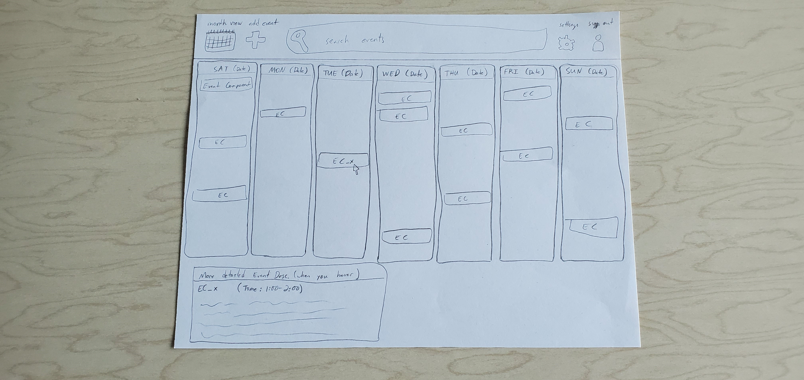
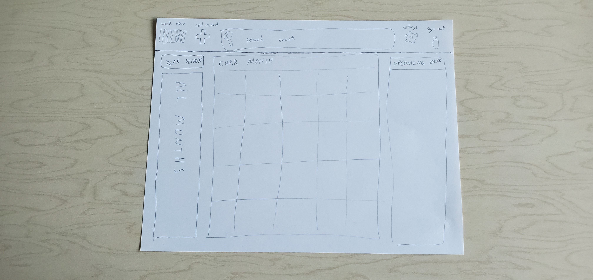

## Table of Contents
* [Overview](#overview)
* [Links](#links)
* [Functionality Goals](#functionality-goals)
* [User Guide](#johnsonslist-walkthrough)
* [Installation](#installation-and-running)

## Overview

This calendar website is a website utilizing semantic ui, react.js, meteor, and mongoDB to create a website that can be used by any user. Community members of UH Manoa will be able to schedule an event on this website by producing or exporting a .ics file

For more information on the techstack used:
* [Meteor](https://www.meteor.com/) for Javascript-based implementation of client and server code. 
* [React](https://reactjs.org/) for component-based UI implementation and routing.
* [Semantic UI React](https://react.semantic-ui.com/) CSS Framework for UI design.
* [MongoDB](https://www.mongodb.com/) Backend Database for adding objects 

## Links

Refer to this section for the various links associated with Johnsonslist.

* [Organization Page](https://kwong41.github.io/ICS414Project/) Calendar project organization page
* [Project Page](http://johnsonslist.meteorapp.com/#/) Johnsonslist's application website
* [Milestone 1 Board](https://github.com/KWong41/ICS414Project/projects/1) Project board for this calendar project

## Functionality Goals

insert Goals here

## Mock pages

Mock page 1


Mock page 2


These are the mock pages that we used as guidance for our project.  The mock pages involve quite a bit of functionality on each mock template.  The functions that we are planning on using involves a search bar, calendar template, description for each event, add event icon, and a settings icon.

## User Guide

insert User Guide here

## Landing page


insert landing page description here

## Home page


insert home page description here

## Website Guide


insert website guide description here

## Insert additional information here


insert additional page description here

## Developer Guide (Windows/Mac)

To intially run the application, [install Meteor](https://www.meteor.com/install).

```
$ meteor npm install
```

Next, go to [this](https://github.com/KWong41/ICS414Project) link to clone this project to your local computer.
You can either download a zip file version of this project or run this project using the commandline:

```
cd (in your local directory of where you stored this project)
```

then run this command:

```
cd app
```

From there, run the following command to start up the application:

```
$ meteor npm run start
```

If done correctly, the application will appear at [http://localhost:3000](http://localhost:3000). 

## Milestone 1

The goal for Milestone 1 was to implement a somewhat working web application using ReactJS, Meteor, MongoDB, and Semantic UI.  We started off by creating "rough-draft" templates of the project website.  By creating these rough-drafts, we began to cut into our creativity and functionality by asking ourselves various innovative and unique questions.  For example, what would the site cater to in the grand-scheme of things?  What would it look like?  What is the target audience for this website?  and so on.  Please click [here](https://github.com/KWong41/ICS414Project/projects/1) for more information about Milestone 1.


Here are some "behind-the-scenes" drawings that we used as mock-up drafts in the creation of our web application.

## Mock-up Home Page


## What makes this project stand out from others (what is our special sauce)?

insert special sauce here

## Meet the team!


Front-End/Back-End Development: Ryuto Kitagawa

[Professional Profile](https://ryutokitagawa.github.io/)

Front-End/Back-End Development: Davon Moss

[Professional Profile](https://davonmoss.github.io/)

Back-End Production/Development/Github.io project page: Kevin Wong

[Professional Profile](https://kwong41.github.io/)

## Community Feedback


## Feedback

If you have any questions or concerns please feel free to contact us with this [feedback page!](insert feedback page)
